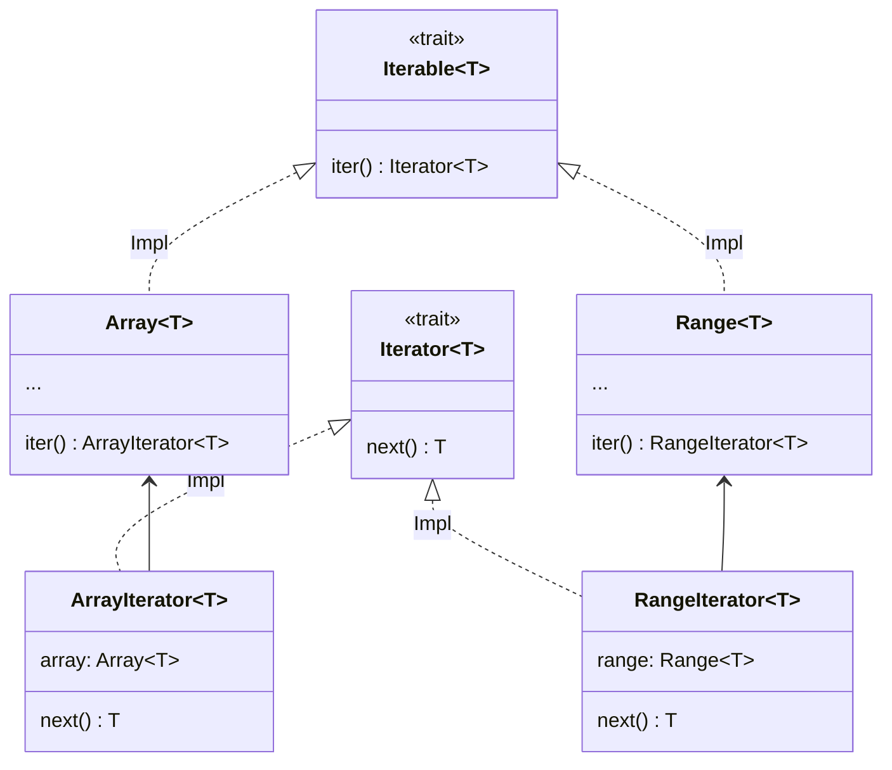

# イテレータ

[](https://gezf7g7pd5.execute-api.ap-northeast-1.amazonaws.com/default/source_up_to_date?owner=erg-lang&repos=erg&ref=main&path=doc/EN/syntax/16_iterator.md&commit_hash=51de3c9d5a9074241f55c043b9951b384836b258)

イテレータは、コンテナの要素を取り出すためのオブジェクトです。

```python
for! 0..9, i =>
    print! i
```

このコードは0から9までの数字を出力します。
それぞれの数字(=Intオブジェクト)は`i`に代入され、`=>`以下の動作(=`print! i`)が実行されます。このような繰り返し実行のことを __イテレーション__ といいます。

ではここで`for!`プロシージャの型シグネチャを見てみましょう。

```python
for!: |T: Type, I <: Iterable T| (I, T => None) => None
```

第一引数は`Iterable`という型のオブジェクトを受け付けるようです。

`Iterable`は`.Iterator`属性, `.iter`メソッドを要求メソッドに持つ型です。

```python
Iterable T = Trait {
    .Iterator = {Iterator}
    .iter = Self(T).() -> Self.Iterator T
}
```

`.Iterator`属性の型`{Iterator}`はいわゆるセットカインド(カインドは[こちら](./type/advanced/kind.md)で説明されています)です。

```python
assert [1, 2, 3] in Iterable(Int)
assert 1..3 in Iterable(Int)
assert [1, 2, 3].Iterator == ArrayIterator
assert (1..3).Iterator == RangeIterator

log [1, 2, 3].iter() # <ArrayIterator object>
log (1..3).iter() # <RangeIterator object>
```

`ArrayIterator`と`RangeIterator`はどちらも`Iterator`を実装するクラスで、`Array`, `Range`にイテレーション機能を与えるためだけに存在します。
このようなデザインパターンをコンパニオンクラス[<sup id="f1">1</sup>](#1)と呼びます。
そして`IteratorImpl`パッチがイテレーション機能のコアです。`Iterator`は`.next`メソッド1つだけを要求し、`IteratorImpl`は実に数十個のメソッドを提供します。`ArrayIterator`や`RangeIterator`は`.next`メソッドを実装するだけで`IteratorImpl`の実装メソッドを使うことができるわけです。この利便性から、標準ライブラリでは多数のイテレータが実装されています。



`Iterable`のような、トレイト(この場合は`Iterator`)を静的ディスパッチでありながら統一的に扱えるインターフェースを提供する型をコンパニオンクラスアダプターと呼びます。

---

<span id="1" style="font-size:x-small"><sup>1</sup> このパターンには統一された名前がないようであるが、Rustでは[companion struct pattern](https://gist.github.com/qnighy/be99c2ece6f3f4b1248608a04e104b38#:~:text=%E3%82%8F%E3%82%8C%E3%81%A6%E3%81%84%E3%82%8B%E3%80%82-,companion%20struct,-%E3%83%A1%E3%82%BD%E3%83%83%E3%83%89%E3%81%A8%E3%80%81%E3%81%9D%E3%81%AE)と呼ばれており、それになぞらえて命名した。[↩](#f1) </span>

<p align='center'>
    <a href='./15_type.md'>Previous</a> | <a href='./17_mutability.md'>Next</a>
</p>
