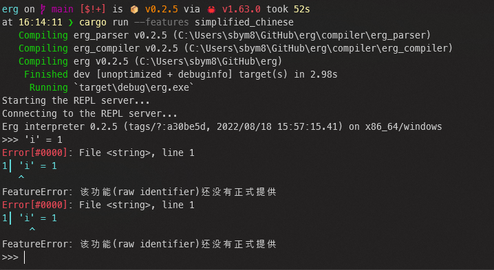

# Multilingualization of Messages

Erg 正在推动消息（开始、选项、文档、提示、警告、错误消息等）的多语言化。如果你不熟悉 Rust 或 Erg，也可以参与此项目。请务必配合。

以下是多语种方法的说明。

## 查找`switch_lang!`

在 Erg 源代码中找到（使用 grep 或编辑器的搜索功能）。我们应该能找到下面这样的东西。

```rust
switch_lang!(
    "japanese" => format!("この機能({name})はまだ正式に提供されていません"),
    "english" => format!("this feature({name}) is not implemented yet"),
),
```

此消息目前仅支持日语和英语。让我们尝试添加简体消息。

## 添加消息

请在查看其他语言内容的同时添加翻译消息。最后不要忘记逗号（,）。

```rust
switch_lang!(
    "japanese" => format!("この機能({name})はまだ正式に提供されていません"),
    "simplified_chinese" => format!("该功能({name})还没有正式提供"),
    "english" => format!("this feature({name}) is not implemented yet"),
),
```

另外，英语是默认设置，一定要排在最后。

`{name}`部分是 Rust 的格式化功能，允许你将变量的内容（`name`）嵌入到字符串中。

## Build

现在，我们使用选项构建它。



你做到了！

## FAQ

Q：像这样的指定是什么意思？A：{RED} 及更高版本将显示为红色。重新启动交互渲染。

Q：如果想添加自己的语言，该如何替换部分？答：目前支持以下语言。

* "english"（默认设置）
* "japanese" (日语)
* "simplified_chinese" (简体中文)
* "traditional_chinese" (繁体中文)

如果你想添加其他语言，请提出请求。
