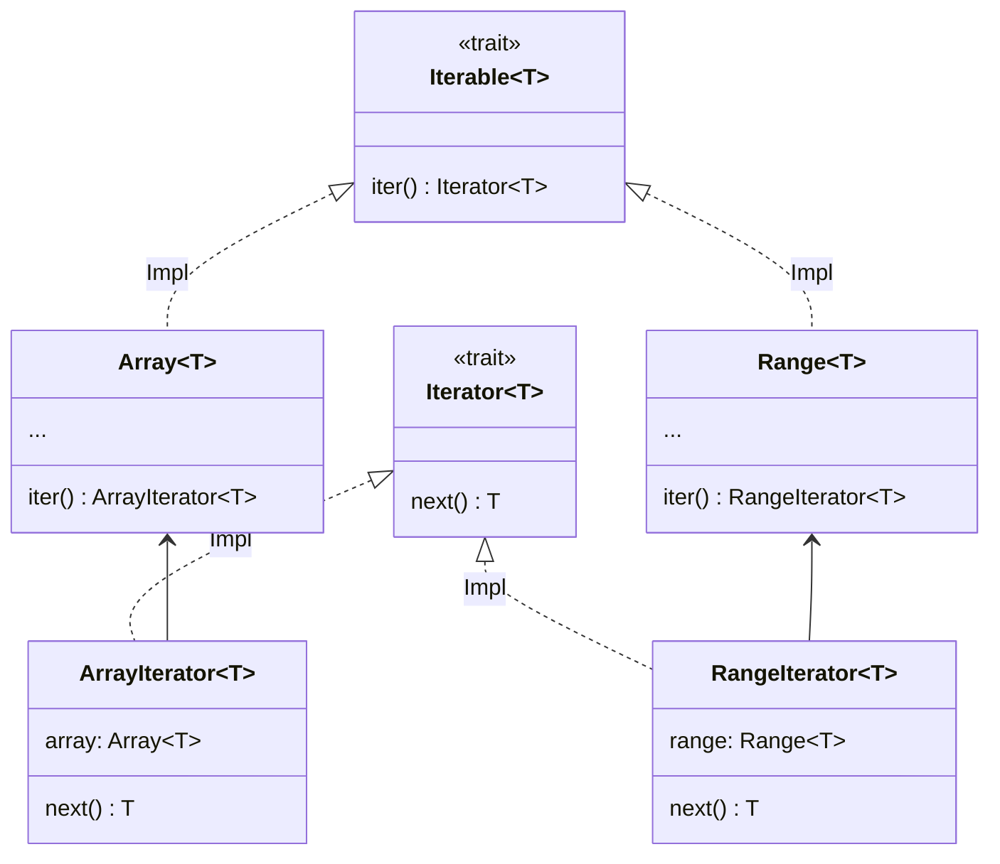

# Iterator

An iterator is an object used to retrieve elements of a container.

```python
for! 0..9, i =>
    print! i
```

This code prints the numbers 0 through 9.
Each number (=Int object) is assigned to `i` and the following operation (=`print! i``) is executed. This kind of repetitive execution is called __iteration__.

Now let's look at the type signature of the `for!` procedure.

```python
for!: |T: Type, I <: Iterable T| (I, T => None) => None
```

The first argument seems to accept an object of type `Iterable`.

`Iterable` is a type with `.Iterator` attribute, `.iter` method in the request method.

```python
Iterable T = Trait {
    .Iterator = {Iterator}
    .iter = Self(T). () -> Self.Iterator T
}
```

The type `{Iterator}` of the `.Iterator` attribute is so-called set-kind (kind is described [here](./type/advanced/kind.md)).

```python
assert [1, 2, 3] in Iterable(Int)
assert 1..3 in Iterable(Int)
assert [1, 2, 3].Iterator == ArrayIterator
assert (1..3).Iterator == RangeIterator

log [1, 2, 3].iter() # <ArrayIterator object
log (1..3).iter() # <RangeIterator object>
```

Both `ArrayIterator` and `RangeIterator` are classes that implement `Iterator` and exist only to give `Array` and `Range` iteration functions.
Such a design pattern is called companion class [<sup id="f1">1</sup>](#1).
And the `IteratorImpl` patch is the core of the iteration functionality. `Iterator` requires only one `.next` method, `IteratorImpl` provides dozens of 方法 indeed. `ArrayIterator` and `RangeIterator` can use the implementation method of `IteratorImpl` just by implementing the `.next` method. For this convenience, the standard library implements a number of iterators.



Types such as `Iterable` that provide an interface for handling traits (in this case `Iterator`) in a static dispatch yet unified manner are called companion class adapters.

---

<span id="1" style="font-size:x-small"><sup>1</sup> There doesn't seem to be a uniform name for this pattern, but in Rust, there is [companion struct pattern]( https://gist.github.com/qnighy/be99c2ece6f3f4b1248608a04e104b38#:~:text=%E3%82%8F%E3%82%8C%E3%81%A6%E3%81%84%E3%82%8B%E3%80%82-,companion%20struct,-%E3%83%A1%E3%82%BD%E3%83%83%E3%83%89%E3%81%A8%E3%80%81%E3 %81%9D%E3%81%AE), and was named after it. [↩](#f1) </span>

<p align='center'>
    <a href='./15_type.md'>Previous</a> | <a href='./17_mutability.md'>Next</a>
</p>
