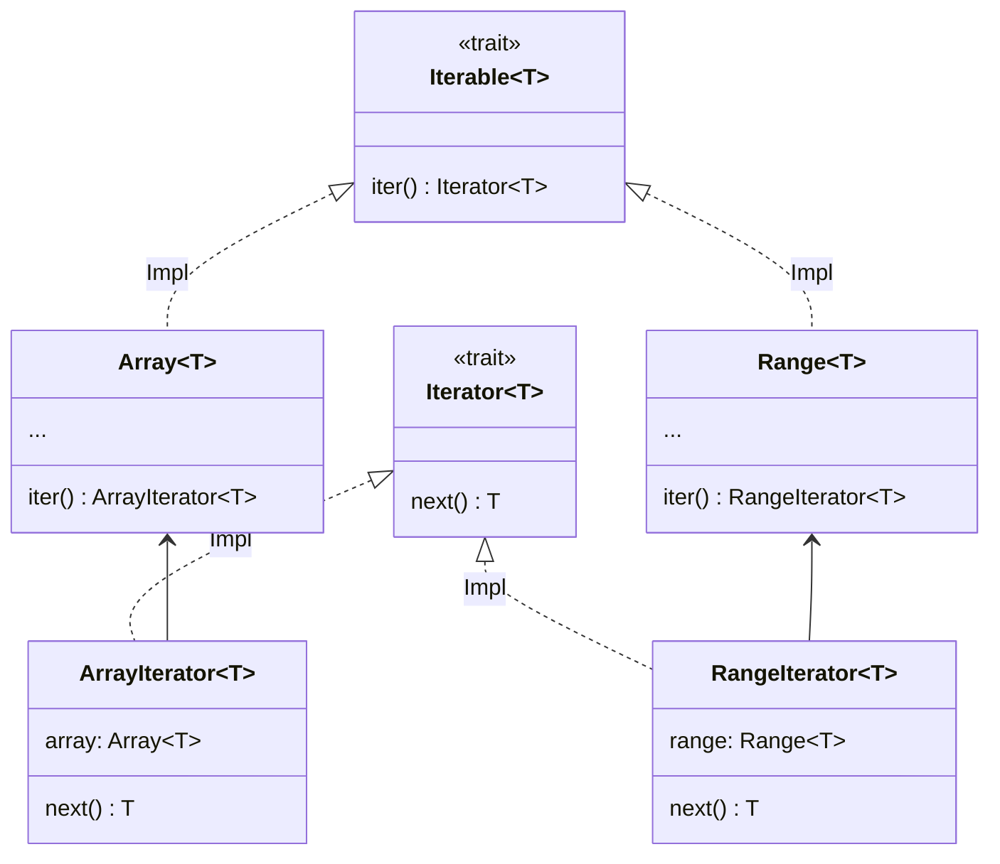

# 迭

迭代器是用于检索容器元素的对象。


```erg
for! 0..9, i =>
    print! i
```

此代码输出 0 到 9 之间的数字。将每个数字（=Int 对象）赋给，并执行以下操作（=<gtr=“7”/>）：这种重复执行称为<gtr=“9”/>。

现在，我们来看一下过程的类型签名。


```erg
for!: |T: Type, I <: Iterable T| (I, T => None) => None
```

第一个参数似乎接受类型为的对象。

是具有<gtr=“13”/>属性和<gtr=“14”/>方法的请求方法类型。


```erg
Iterable T = Trait {
    .Iterator = {Iterator}
    .iter = Self(T).() -> Self.Iterator T
}
```

属性类型<gtr=“16”/>是所谓的设置卡印（卡印在<gtr=“17”/>中描述）。


```erg
assert [1, 2, 3] in Iterable(Int)
assert 1..3 in Iterable(Int)
assert [1, 2, 3].Iterator == ArrayIterator
assert (1..3).Iterator == RangeIterator

log [1, 2, 3].iter() # <ArrayIterator object>
log (1..3).iter() # <RangeIterator object>
```

和<gtr=“19”/>都是实现<gtr=“20”/>的类，它们的存在只是为了赋予<gtr=“21”/>和<gtr=“22”/>小版本功能。这种设计模式称为伴随类<gtr=“31”/>。而<gtr=“23”/>修补程序是小版本功能的核心。<gtr=“24”/>只需要一个<gtr=“25”/>方法，<gtr=“26”/>实际上提供了几十个方法。<gtr=“27”/>和<gtr=“28”/>只需实现<gtr=“29”/>方法即可使用<gtr=“30”/>的实现方法。由于这种便利性，标准库实现了许多迭代器。




提供一个接口的类型，如，在本例中为<gtr=“33”/>）是静态调度，但可以统一处理，这种类型称为伴随类适配器。

---

<span id="1" style="font-size:x-small">1这个模式似乎没有统一的名字，但在 Rust 中被称为，并以此为参照命名。</span>

<p align='center'>
    <a href='./15_type.md'>Previous</a> | <a href='./17_mutability.md'>Next</a>
</p>
