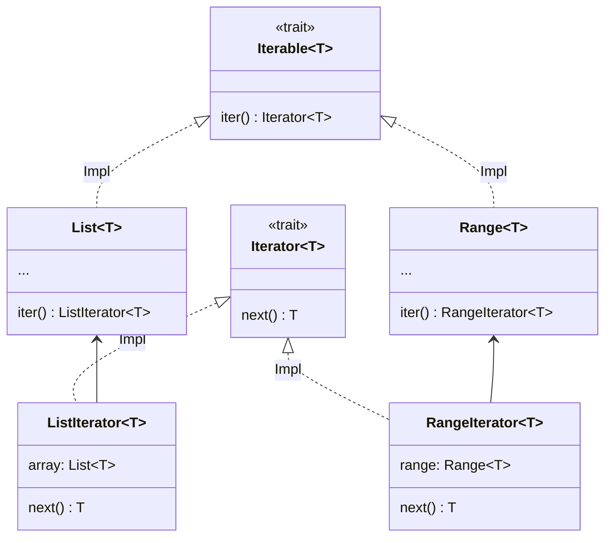

# 迭代器

[](https://gezf7g7pd5.execute-api.ap-northeast-1.amazonaws.com/default/source_up_to_date?owner=erg-lang&repos=erg&ref=main&path=doc/EN/syntax/17_iterator.md&commit_hash=e959b3e54bfa8cee4929743b0193a129e7525c61)

迭代器是用于检索容器元素的对象

```python
for! 0..9, i =>
    print! i
```

此代码打印数字 0 到 9
每个数字(=Int 对象)都分配给`i`，并执行以下操作(=`print！i`)。这种重复执行称为__iteration__

现在让我们看看 `for!` 过程的类型签名

```python
for!: |T: Type, I <: Iterable T| (I, T => None) => None
```

第一个参数似乎接受"Iterable"类型的对象

`Iterable` 是一个具有`.Iterator` 属性的类型，`.iter` 方法在request 方法中

```python
Iterable T = Trait {
    .Iterator = {Iterator}
    .iter = (self: Self) -> Self.Iterator T
}
```

`.Iterator` 属性的类型 `{Iterator}` 是所谓的 set-kind(kind 在 [here](./type/advanced/kind.md) 中描述)

```python
assert [1, 2, 3] in Iterable(Int)
assert 1..3 in Iterable(Int)
assert [1, 2, 3].Iterator == ListIterator
assert (1..3).Iterator == RangeIterator

log [1, 2, 3].iter() # <数组迭代器对象>
log (1..3).iter() # <Range迭代器对象>
```

`ListIterator` 和 `RangeIterator` 都是实现 `Iterator` 的类，它们的存在只是为了提供 `List` 和 `Range` 迭代函数
这种设计模式称为伴生类 [<sup id="f1">1</sup>](#1)
而"IteratorImpl"补丁是迭代功能的核心。`Iterator` 只需要一个`.next` 方法，`IteratorImpl` 确实提供了几十种方法。`ListIterator`和`RangeIterator`只需实现`.next`方法就可以使用`IteratorImpl`的实现方法。为了方便起见，标准库实现了许多迭代器



诸如 `Iterable` 之类的以静态分派但统一的方式提供用于处理Trait(在本例中为 `Iterator`)的trait的类型称为伴生类适配器

---

<span id="1" style="font-size:x-small"><sup>1</sup> 这个模式似乎没有统一的名称，但是在 Rust 中，有 [companion struct 模式]( https://gist.github.com/qnighy/be99c2ece6f3f4b1248608a04e104b38# :~:text=%E3%82%8F%E3%82%8C%E3%81%A6%E3%81%84%E3%82 %8B%E3%80%82-,companion%20struct,-%E3%83%A1%E3%82%BD%E3%83%83%E3%83%89%E3%81%A8%E3%80% 81%E3 %81%9D%E3%81%AE)，并以此命名。[↩](#f1) </span>

<p align='center'>
    <a href='./16_type.md'>上一页</a> | <a href='./18_mutability.md'>下一页</a>
</p>
