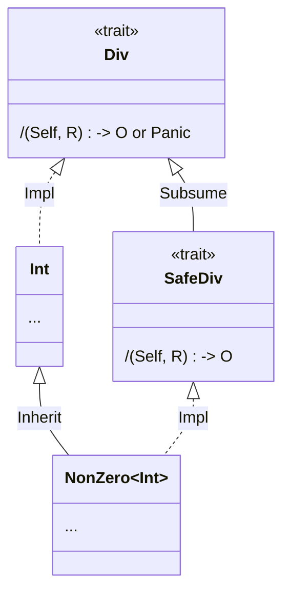

# NonZero N

表示非零數的類。保證除零的安全性

```mermaid
classDiagram
    class NonZero~Int~ {
        ...
    }
    class Int {
        ...
    }
    class Div {
        <<trait>>
        /(Self, R) -> O or Panic
    }
    class SafeDiv {
        <<trait>>
        /(Self, R) -> O
    }
    Int <|-- NonZero~Int~: Inherit
    Div <|-- SafeDiv: Subsume
    SafeDiv <|.. NonZero~Int~: Impl
    Div <|.. Int: Impl
```

## 方法

@Impl SafeDiv R, O
.`/`: Self.(R) -> O
