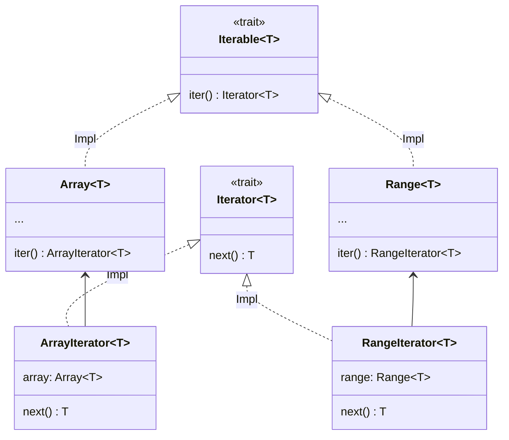

# 迭

迭代器是用於檢索容器元素的對象。


```erg
for! 0..9, i =>
    print! i
```

此代碼輸出 0 到 9 之間的數字。將每個數字（=Int 對象）賦給，並執行以下操作（=<gtr=“7”/>）：這種重複執行稱為<gtr=“9”/>。

現在，我們來看一下過程的類型簽名。


```erg
for!: |T: Type, I <: Iterable T| (I, T => None) => None
```

第一個參數似乎接受類型為的對象。

是具有<gtr=“13”/>屬性和<gtr=“14”/>方法的請求方法類型。


```erg
Iterable T = Trait {
    .Iterator = {Iterator}
    .iter = Self(T).() -> Self.Iterator T
}
```

屬性類型<gtr=“16”/>是所謂的設置卡印（卡印在<gtr=“17”/>中描述）。


```erg
assert [1, 2, 3] in Iterable(Int)
assert 1..3 in Iterable(Int)
assert [1, 2, 3].Iterator == ArrayIterator
assert (1..3).Iterator == RangeIterator

log [1, 2, 3].iter() # <ArrayIterator object>
log (1..3).iter() # <RangeIterator object>
```

和<gtr=“19”/>都是實現<gtr=“20”/>的類，它們的存在只是為了賦予<gtr=“21”/>和<gtr=“22”/>小版本功能。這種設計模式稱為伴隨類<gtr=“31”/>。而<gtr=“23”/>修補程序是小版本功能的核心。 <gtr=“24”/>只需要一個<gtr=“25”/>方法，<gtr=“26”/>實際上提供了幾十個方法。 <gtr=“27”/>和<gtr=“28”/>只需實現<gtr=“29”/>方法即可使用<gtr=“30”/>的實現方法。由於這種便利性，標準庫實現了許多迭代器。




提供一個接口的類型，如，在本例中為<gtr=“33”/>）是靜態調度，但可以統一處理，這種類型稱為伴隨類適配器。

---

<span id="1" style="font-size:x-small">1這個模式似乎沒有統一的名字，但在 Rust 中被稱為，並以此為參照命名。 </span>

<p align='center'>
    <a href='./15_type.md'>Previous</a> | <a href='./17_mutability.md'>Next</a>
</p>