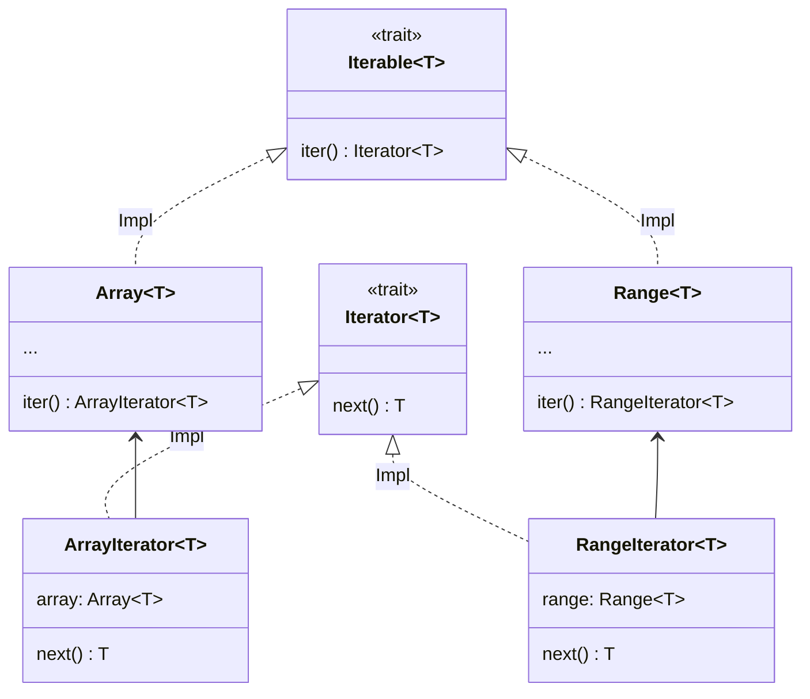

# 迭代器

[](https://gezf7g7pd5.execute-api.ap-northeast-1.amazonaws.com/default/source_up_to_date?owner=erg-lang&repos=erg&ref=main&path=doc/EN/syntax/16_iterator.md&commit_hash=14657486719a134f494e107774ac8f9d5a63f083)

迭代器是用于檢索容器元素的對象。

```python
for! 0..9, i =>
    print! i
```

此代碼打印數字 0 到 9。
每個數字(=Int 對象)都分配給`i`，并執行以下操作(=`print！i`)。 這種重復執行稱為__iteration__。

現在讓我們看看 `for!` 過程的類型簽名。

```python
for!: |T: Type, I <: Iterable T| (I, T => None) => None
```

第一個參數似乎接受"Iterable"類型的對象。

`Iterable` 是一個具有`.Iterator` 屬性的類型，`.iter` 方法在request 方法中。

```python
Iterable T = Trait {
    .Iterator = {Iterator}
    .iter = (self: Self) -> Self.Iterator T
}
```

`.Iterator` 屬性的類型 `{Iterator}` 是所謂的 set-kind(kind 在 [here](./type/advanced/kind.md) 中描述)

```python
assert [1, 2, 3] in Iterable(Int)
assert 1..3 in Iterable(Int)
assert [1, 2, 3].Iterator == ArrayIterator
assert (1..3).Iterator == RangeIterator

log [1, 2, 3].iter() # <數組迭代器對象>
log (1..3).iter() # <Range迭代器對象>
```

`ArrayIterator` 和 `RangeIterator` 都是實現 `Iterator` 的類，它們的存在只是為了提供 `Array` 和 `Range` 迭代函數。
這種設計模式稱為伴生類 [<sup id="f1">1</sup>](#1)。
而"IteratorImpl"補丁是迭代功能的核心。 `Iterator` 只需要一個`.next` 方法，`IteratorImpl` 確實提供了幾十種方法。 `ArrayIterator`和`RangeIterator`只需實現`.next`方法就可以使用`IteratorImpl`的實現方法。 為了方便起見，標準庫實現了許多迭代器。



諸如 `Iterable` 之類的以靜態分派但統一的方式提供用于處理特征(在本例中為 `Iterator`)的接口的類型稱為伴生類適配器。

---

<span id="1" style="font-size:x-small"><sup>1</sup> 這個模式似乎沒有統一的名稱，但是在 Rust 中，有 [companion struct 模式]( https://gist.github.com/qnighy/be99c2ece6f3f4b1248608a04e104b38#:~:text=%E3%82%8F%E3%82%8C%E3%81%A6%E3%81%84%E3%82 %8B%E3%80%82-,companion%20struct,-%E3%83%A1%E3%82%BD%E3%83%83%E3%83%89%E3%81%A8%E3%80% 81%E3 %81%9D%E3%81%AE)，并以此命名。 [?](#f1) </span>

<p align='center'>
    <a href='./15_type.md'>上一頁</a> | <a href='./17_mutability.md'>下一頁</a>
</p>
